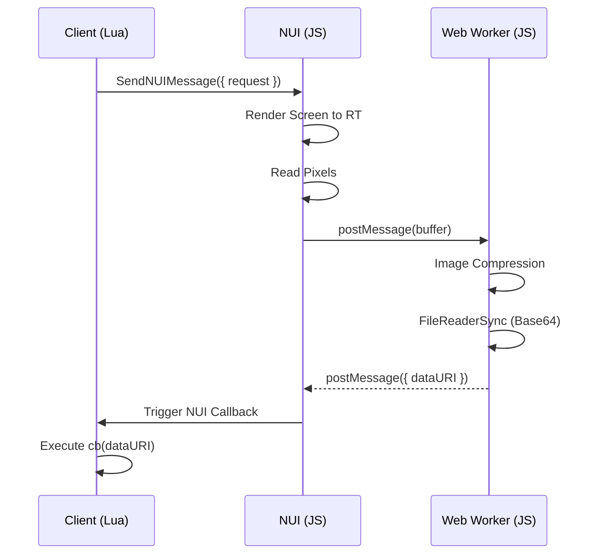
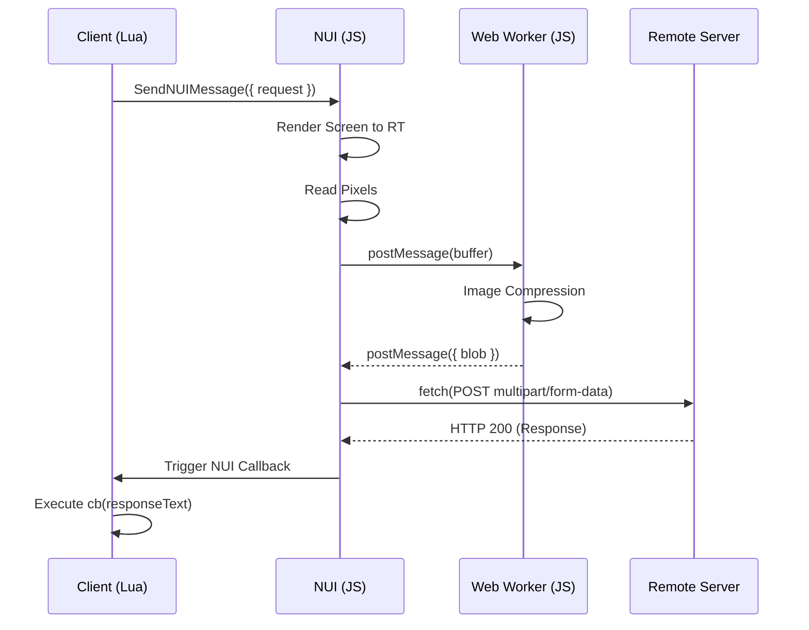

# better screenshot-basic for FiveM

## Description

screenshot-basic is a basic resource for making screenshots of clients' game render targets using FiveM. It uses the same backing
WebGL/OpenGL ES calls as used by the `application/x-cfx-game-view` plugin (see the code in [citizenfx/fivem](https://github.com/citizenfx/fivem/blob/b0a7cda1007dc53d2ba0f638c035c0a5d1402796/data/client/bin/d3d_rendering.cc#L248)),
and wraps these calls using Three.js to 'simplify' WebGL initialization and copying to a buffer from asynchronous NUI.

## Performance Optimization

The screenshot capture process is heavily optimized to ensure minimal impact on game performance:

| Resource         | CPU msec Idle (Before) | CPU msec Idle (After) |
| ---------------- | ---------------------- | --------------------- |
| screenshot-basic | 0.03 ms                | 0.00 ms               |

- **On-demand Rendering**: The GPU only renders when a screenshot request is queued, eliminating idle frame overhead entirely.
- **Request Queuing**: Multiple rapid screenshot requests are queued and processed one per frame, preventing data loss and ensuring sequential handling.
- **Web Worker Processing**: All image compression, encoding, and Base64 conversion are offloaded to a dedicated background thread using `OffscreenCanvas`, `convertToBlob`, and `FileReaderSync`.
- **Reusable Canvas**: The worker reuses a single `OffscreenCanvas` instance, resizing it only when dimensions change, reducing garbage collection pressure.
- **Zero-copy Transfers**: Pixel data is transferred to and from the worker using `Transferable` objects, ensuring zero-copy overhead for large image buffers.
- **Buffer Recycling**: `ArrayBuffer` instances are recycled between the worker and the main thread, minimizing memory allocation during rapid captures.

## Installation

1. Backup your existing screenshot-basic and remove it from your resources folder.
2. Download the latest release from the [GitHub Releases](https://github.com/betters-dev/screenshot-basic/releases) page.
3. Extract the contents into your server's `resources` folder.
4. Add `ensure screenshot-basic` to your `server.cfg`.

## Building the UI

The UI is built using [Bun](https://bun.sh/). If you modify the files in the `ui/` directory, you need to rebuild the `ui.html` file:

```bash
bun install
bun run build
```

## API

### Client

#### requestScreenshot(options?: any, cb: (result: string) => void)

Takes a screenshot and passes the data URI to a callback. Please don't send this through _any_ server events.



Arguments:

- **options**: An optional object containing options.
  - **encoding**: 'png' | 'jpg' | 'webp' - The target image encoding. Defaults to 'webp'.
  - **quality**: number - The quality for a lossy image encoder, in a range for 0.0-1.0. Defaults to 0.92.
- **cb**: A callback upon result.
  - **result**: A `base64` data URI for the image.

Example:

```lua
exports['screenshot-basic']:requestScreenshot(function(dataURI)
    TriggerEvent('chat:addMessage', { template = '', args = { dataURI } })
end)
```

#### requestScreenshotUpload(url: string, field: string, options?: any, cb: (result: string) => void)

Takes a screenshot and uploads it as a file (`multipart/form-data`) to a remote HTTP URL.



Arguments:

- **url**: The URL to a file upload handler.
- **field**: The name for the form field to add the file to.
- **options**: An optional object containing options.
  - **encoding**: 'png' | 'jpg' | 'webp' - The target image encoding. Defaults to 'webp'.
  - **quality**: number - The quality for a lossy image encoder, in a range for 0.0-1.0. Defaults to 0.92.
- **cb**: A callback upon result.
  - **result**: The response data for the remote URL.

Example:

```lua
exports['screenshot-basic']:requestScreenshotUpload('https://discord.com/api/webhooks/...', 'files[]', function(responseText)
    local data = json.decode(responseText)
    TriggerEvent('chat:addMessage', { template = '', args = { data.attachments[1].url } })
end)
```
