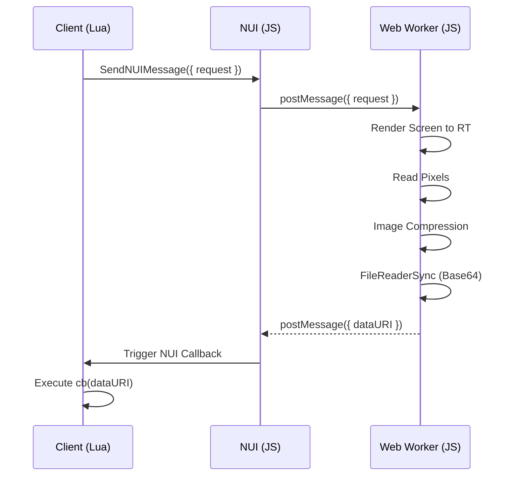
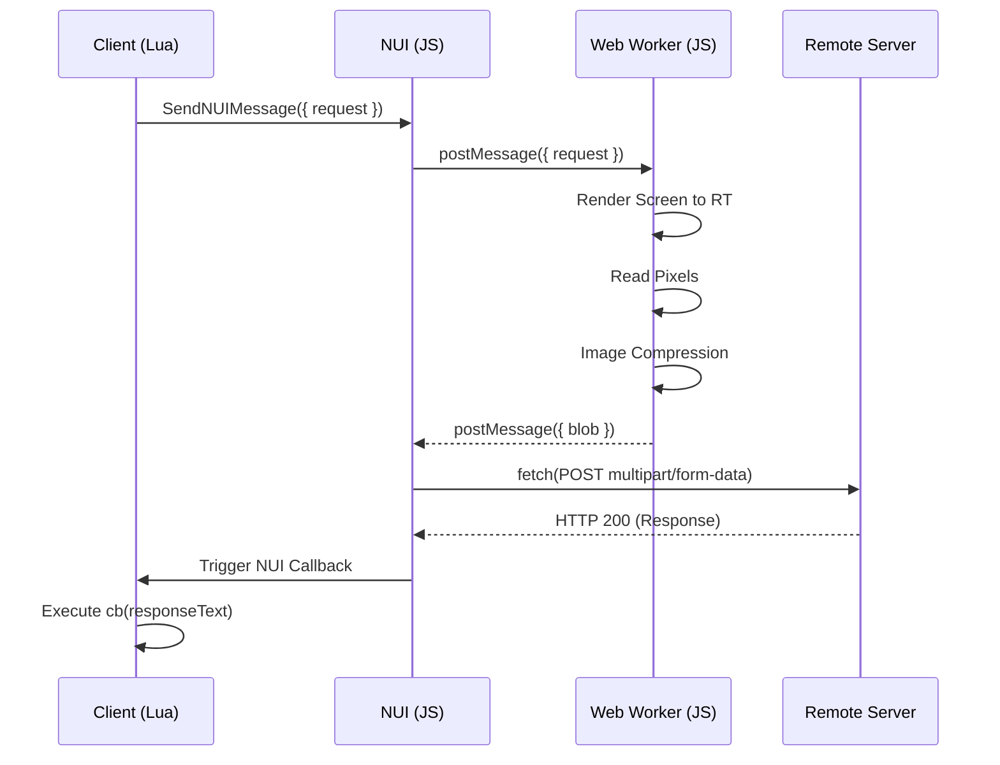
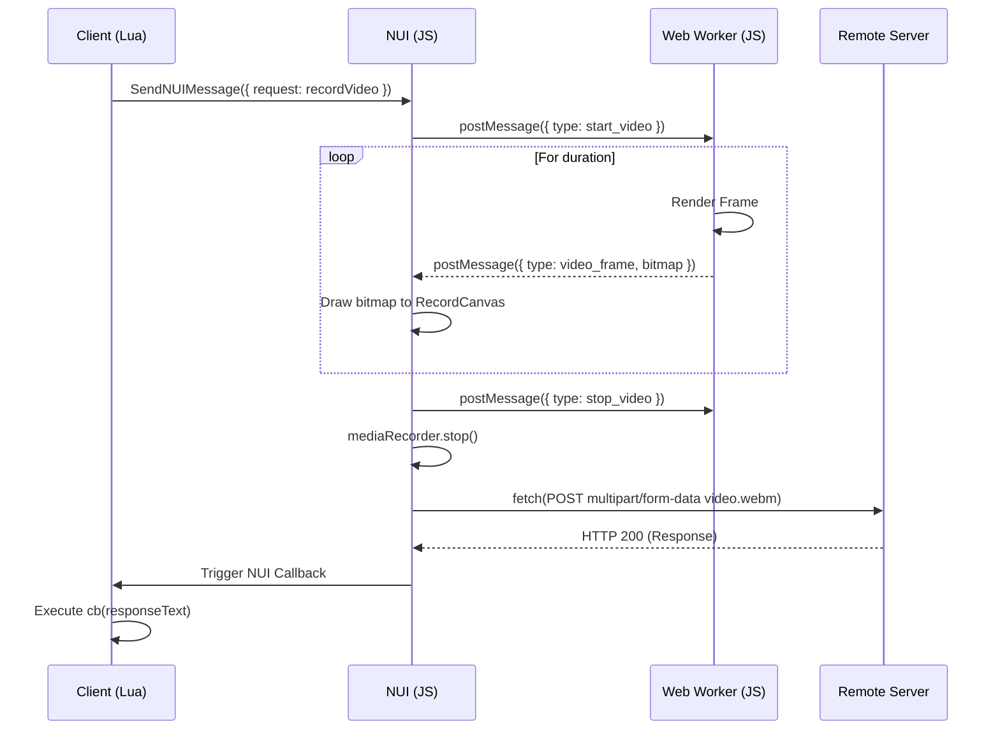

# better screenshot-basic for FiveM

## Description

`screenshot-basic` is a high-performance resource for making screenshots of clients' game render targets using FiveM. It uses the same backing WebGL/OpenGL ES calls as the `application/x-cfx-game-view` plugin (see the code in [citizenfx/fivem](https://github.com/citizenfx/fivem/blob/b0a7cda1007dc53d2ba0f638c035c0a5d1402796/data/client/bin/d3d_rendering.cc#L248)).

Unlike the original resource, this version completely removes heavy dependencies like Three.js. It utilizes **raw WebGL** and **Web Workers** for highly optimized, non-blocking captures that operate entirely off the main UI thread.

## Performance Optimization

The screenshot capture process is heavily optimized to ensure minimal impact on game performance:

| Metric               | Before   | After   | Improvement        |
| :------------------- | :------- | :------ | :----------------- |
| **CPU msec Idle**    | ~0.03 ms | 0.00 ms | **100% Reduction** |
| **ui.html Size**     | ~530 KB  | < 10 KB | **> 98% Smaller**  |
| **Main Thread Time** | ~240 ms  | ~1 ms   | **~99.5% Faster**  |

### ✨ Key Architectural Improvements

**🎨 Rendering & Pipeline**

- **On-Demand Rendering:** The WebGL context now only executes draw calls when a screenshot is actively requested. This completely eliminates idle GPU/CPU overhead, returning precious frame budget back to the game.
- **Robust Request Queuing:** Rapid, concurrent screenshot requests are now safely queued and processed sequentially (one per frame). This guarantees zero data loss and prevents race conditions during burst captures.

**⚡ Threading & Memory Optimization**

- **Off-Main-Thread Processing:** All heavy image operations—including WebGL rendering, compression, encoding, and Base64 conversion—are now entirely offloaded to a dedicated Web Worker. This ensures the main UI thread remains buttery smooth during captures.
- **Zero-Copy Transfers:** Raw pixel data is passed between the Worker and main thread using `Transferable` objects. This avoids expensive memory cloning, ensuring instantaneous data handoffs even for massive 4K buffers.
- **Canvas & Buffer Pooling:** The worker maintains a persistent, reusable `OffscreenCanvas` and recycles `ArrayBuffer` instances. By only resizing or allocating when absolutely necessary, we drastically reduce Garbage Collection (GC) spikes and memory fragmentation during rapid-fire captures.

## Installation

1. Backup your existing `screenshot-basic` and remove it from your resources folder.
2. Download the latest release from the [GitHub Releases](https://github.com/betters-dev/screenshot-basic/releases) page.
3. Extract the contents into your server's `resources` folder.
4. Add `ensure screenshot-basic` to your `server.cfg`.

## Building the UI

The UI is built using [Bun](https://bun.sh/). If you modify the files in the `ui/` directory, you need to rebuild the `ui.html` file:

```bash
bun install
bun run build
```

## API

### Client

#### requestScreenshot(options?: any, cb: (result: string) => void)

Takes a screenshot and passes the data URI to a callback. Please don't send this through _any_ server events.



Arguments:

- **options**: An optional object containing options.
  - **encoding**: 'png' | 'jpg' | 'webp' - The target image encoding. Defaults to 'jpg'.
  - **quality**: number - The quality for a lossy image encoder, in a range for 0.0-1.0. Defaults to 0.92.
- **cb**: A callback upon result.
  - **result**: A `base64` data URI for the image.

Example:

```lua
exports['screenshot-basic']:requestScreenshot(function(dataURI)
    TriggerEvent('chat:addMessage', { template = '', args = { dataURI } })
end)
```

#### requestScreenshotUpload(url: string, field: string, options?: any, cb: (result: string) => void)

Takes a screenshot and uploads it as a file (`multipart/form-data`) to a remote HTTP URL.



Arguments:

- **url**: The URL to a file upload handler.
- **field**: The name for the form field to add the file to.
- **options**: An optional object containing options.
  - **encoding**: 'png' | 'jpg' | 'webp' - The target image encoding. Defaults to 'jpg'.
  - **quality**: number - The quality for a lossy image encoder, in a range for 0.0-1.0. Defaults to 0.92.
- **cb**: A callback upon result.
  - **result**: The response data for the remote URL.

Example:

```lua
exports['screenshot-basic']:requestScreenshotUpload('https://discord.com/api/webhooks/...', 'files[]', function(responseText)
    local data = json.decode(responseText)
    TriggerEvent('chat:addMessage', { template = '', args = { data.attachments[1].url } })
end)
```

#### requestRecordVideoUpload(url: string, field: string, options?: any, cb: (result: string) => void)

Takes a short video recording of the game and uploads it to a remote HTTP URL.



Arguments:

- **url**: The URL to a file upload handler.
- **field**: The name for the form field to add the file to.
- **options**: An optional object containing options.
  - **duration**: number - The duration of the recording in milliseconds. Defaults to 5000.
- **cb**: A callback upon result.
  - **result**: The response data for the remote URL.

Example:

```lua
exports['screenshot-basic']:requestRecordVideoUpload('https://discord.com/api/webhooks/...', 'files[]', {
    duration = 3000
}, function(responseText)
    local data = json.decode(responseText)
    TriggerEvent('chat:addMessage', { template = '<video controls src="{0}" style="max-width: 300px;" />', args = { data.attachments[1].url } })
end)
```
