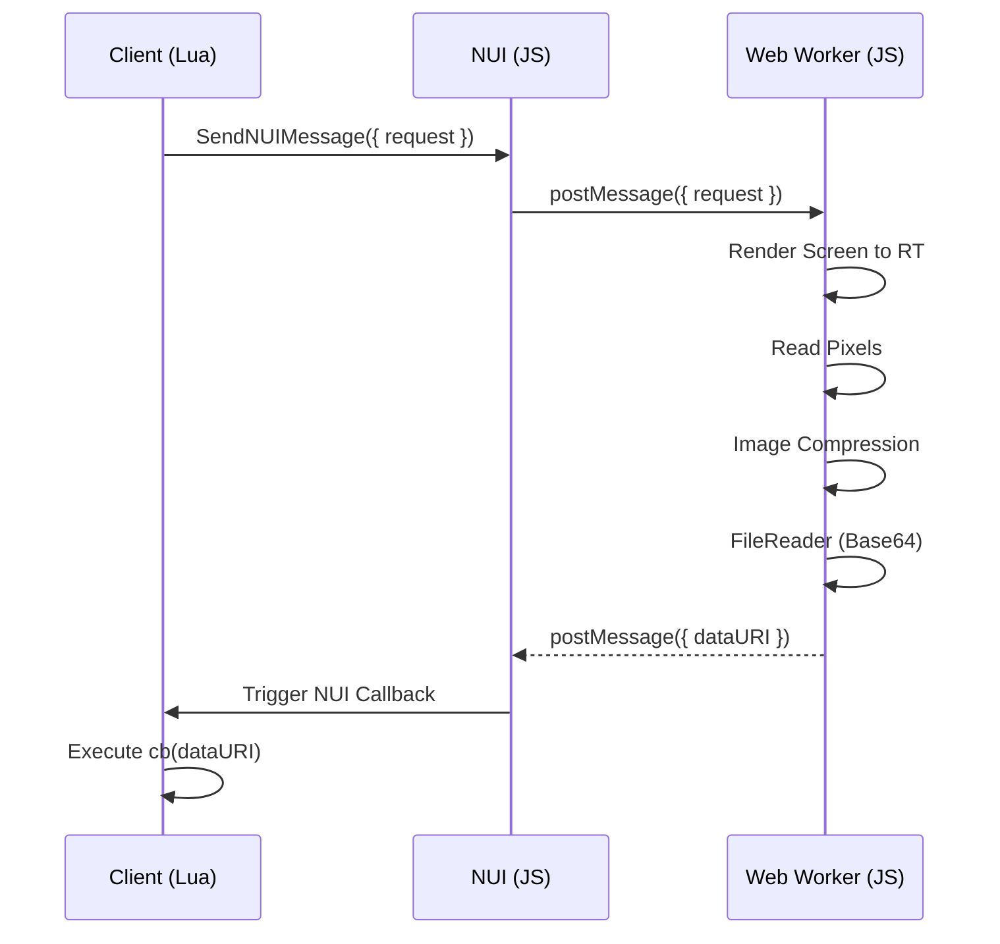
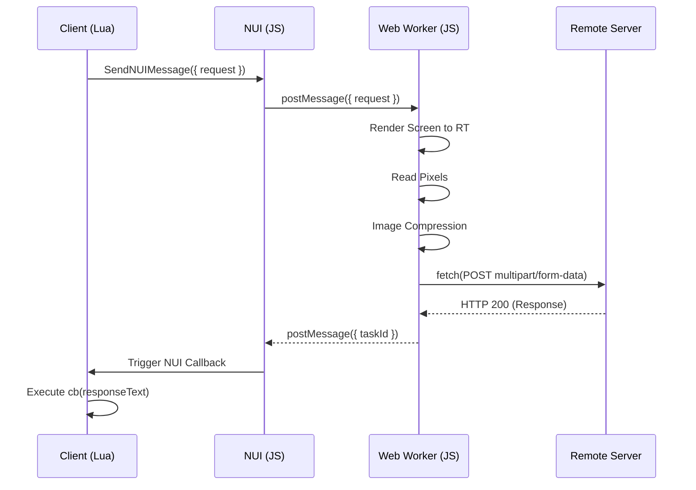
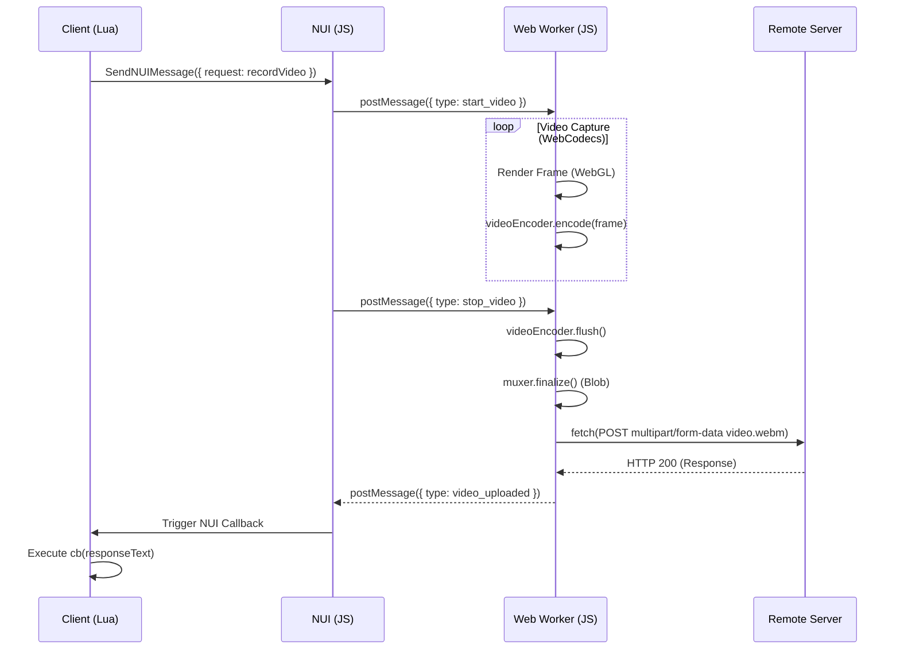

# better screenshot-basic for FiveM

## Description

`screenshot-basic` is a high-performance resource for making screenshots of clients' game render targets using FiveM. It uses the same backing WebGL/OpenGL ES calls as the `application/x-cfx-game-view` plugin (see the code in [citizenfx/fivem](https://github.com/citizenfx/fivem/blob/b0a7cda1007dc53d2ba0f638c035c0a5d1402796/data/client/bin/d3d_rendering.cc#L248)).

Unlike the original resource, this version completely removes heavy dependencies like Three.js. It utilizes **raw WebGL** and **Web Workers** for highly optimized, non-blocking captures that operate entirely off the main UI thread.

## Performance Optimization

The screenshot capture process is heavily optimized to ensure minimal impact on game performance:

| Metric               | Before   | After   | Reduce    |
|:---------------------|:---------|:--------|:----------|
| **CPU msec Idle**    | ~0.03 ms | 0.00 ms | **100%**  |
| **Main Thread Time** | ~240 ms  | < 1 ms  | **99.5%** |
| **ui.html Size**     | ~530 KB  | < 15 KB | **97%**   |

### ✨ Features

**🎨 Rendering & Pipeline**

- **On-Demand Rendering:** The WebGL context now only executes draw calls when a screenshot is actively requested. This completely eliminates idle GPU/CPU overhead, returning precious frame budget back to the game.
- **Robust Request Queuing:** Rapid, concurrent screenshot requests are now safely queued and processed sequentially (one per frame). This guarantees zero data loss and prevents race conditions during burst captures.
- **Video Recording:** High-performance video capture support (WebM/VP9) at 30 FPS, allowing for short gameplay clips to be recorded and uploaded directly to remote endpoints.

**⚡ Threading & Memory Optimization**

- **Off-Main-Thread Processing:** All heavy image operations—including WebGL rendering, compression, encoding, and Base64 conversion—are now entirely offloaded to a dedicated Web Worker. This ensures the main UI thread remains buttery smooth during captures.
- **Zero-Copy Canvas:** The UI's rendering control is transferred directly to the Web Worker via `OffscreenCanvas`. This allows the worker to capture and process frames directly from the GPU, completely bypassing the main thread's memory space.
- **Buffer Recycling:** The worker utilizes a persistent `ArrayBuffer` pool for `readPixels` operations. By recycling these buffers instead of reallocating them, we ensure instantaneous data handling even for massive 4K captures without triggering Garbage Collection (GC) spikes.

## Installation

1. Backup your existing `screenshot-basic` and remove it from your resources folder.
2. Download the latest release from the [GitHub Releases](https://github.com/betters-dev/screenshot-basic/releases) page.
3. Extract the contents into your server's `resources` folder.
4. Add `ensure screenshot-basic` to your `server.cfg`.

## Building the ui.html

The UI is built using [Bun](https://bun.sh/). If you modify the files in the `ui/` directory, you need to rebuild the `ui.html` file:

```bash
bun install
bun run build
```

## API

### Client

#### requestScreenshot(options?: any, cb: (result: string) => void)

Takes a screenshot and passes the data URI to a callback. Please don't send this through _any_ server events.



Arguments:

| Argument           | Type       | Required | Default | Description                                                |
|:-------------------|:-----------|:---------|:--------|:-----------------------------------------------------------|
| **options**        | `object`   | -        | `{}`    | An object containing options.                              |
| `options.encoding` | `string`   | -        | `'jpg'` | The target image encoding (`'png'`, `'jpg'`, or `'webp'`). |
| `options.quality`  | `number`   | -        | `0.92`  | The quality for lossy encoders (0.0 to 1.0).               |
| `options.headers`  | `object`   | -        | `{}`    | HTTP headers to send to the internal callback.             |
| **cb**             | `function` | Yes      | -       | A callback invoked with the `base64` data URI.             |

Example:

```lua
exports['screenshot-basic']:requestScreenshot(function(dataURI)
    TriggerEvent('chat:addMessage', { template = '', args = { dataURI } })
end)
```

#### requestScreenshotUpload(url: string, field: string, options?: any, cb: (result: string) => void)

Takes a screenshot and uploads it as a file (`multipart/form-data`) to a remote HTTP URL.



Arguments:

| Argument           | Type       | Required | Default | Description                                                          |
|:-------------------|:-----------|:---------|:--------|:---------------------------------------------------------------------|
| **url**            | `string`   | Yes      | -       | The URL to a file upload handler.                                    |
| **field**          | `string`   | Yes      | -       | The name for the form field to add the file to.                      |
| **options**        | `object`   | -        | `{}`    | An object containing options.                                        |
| `options.encoding` | `string`   | -        | `'jpg'` | The target image encoding (`'png'`, `'jpg'`, or `'webp'`).           |
| `options.quality`  | `number`   | -        | `0.92`  | The quality for lossy encoders (0.0 to 1.0).                         |
| `options.headers`  | `object`   | -        | `{}`    | HTTP headers to include in the upload request.                       |
| `options.fields`   | `object`   | -        | `{}`    | Additional form fields to include in the `multipart/form-data` body. |
| **cb**             | `function` | Yes      | -       | A callback invoked with the remote server response.                  |

Example:

```lua
exports['screenshot-basic']:requestScreenshotUpload('https://discord.com/api/webhooks/...', 'files[]', function(responseText)
    local data = json.decode(responseText)
    TriggerEvent('chat:addMessage', { template = '', args = { data.attachments[1].url } })
end)
```

#### requestRecordVideoUpload(url: string, field: string, options?: any, cb: (result: string) => void)

Takes a short video recording of the game and uploads it to a remote HTTP URL.



Arguments:

| Argument           | Type       | Required | Default | Description                                                          |
|:-------------------|:-----------|:---------|:--------|:---------------------------------------------------------------------|
| **url**            | `string`   | Yes      | -       | The URL to a file upload handler.                                    |
| **field**          | `string`   | Yes      | -       | The name for the form field to add the file to.                      |
| **options**        | `object`   | -        | `{}`    | An object containing options.                                        |
| `options.duration` | `number`   | -        | `5000`  | The duration of the recording in milliseconds.                       |
| `options.headers`  | `object`   | -        | `{}`    | HTTP headers to include in the upload request.                       |
| `options.fields`   | `object`   | -        | `{}`    | Additional form fields to include in the `multipart/form-data` body. |
| **cb**             | `function` | Yes      | -       | A callback invoked with the remote server response.                  |

Example:

```lua
exports['screenshot-basic']:requestRecordVideoUpload('https://discord.com/api/webhooks/...', 'files[]', {
    duration = 3000
}, function(responseText)
    local data = json.decode(responseText)
    TriggerEvent('chat:addMessage', { template = '<video controls src="{0}" style="max-width: 300px;" />', args = { data.attachments[1].url } })
end)
```
